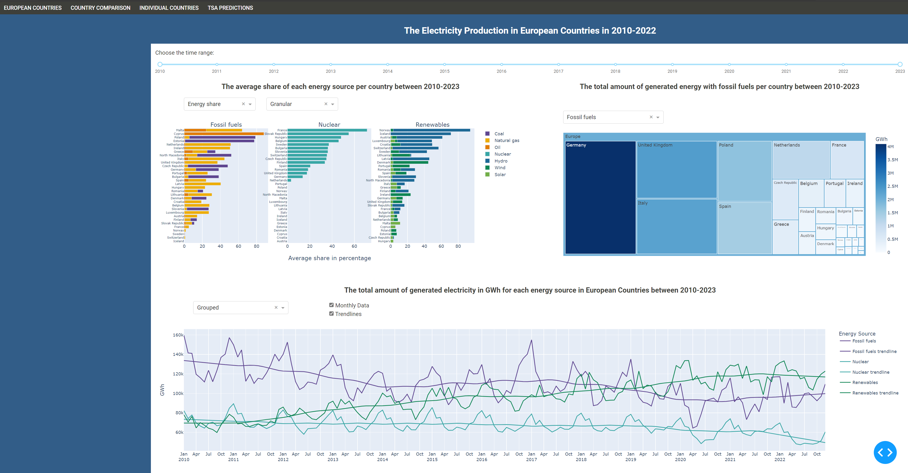

# Web Application for Analysing the Green Energy Transition in Europe

A Plotly / Dash / Flask web application to analyse and visualise the energy transition data in European countries. The web application also presents the predictions for the total generated electricity for certain energy groups by using Triple Holt-Winters Exponential Smoothing (HWES) and SARIMA. The data is a subset of the International Energy Agency’s (IAE) monthly Electricity Statistics from [Kaggle](https://www.kaggle.com/datasets/ccanb23/iea-monthly-electricity-statistics), licenced under ODC-By v1.0

Please see the details of the file structure and information about each file below.

# Controls:
- All pages have a time series slider to select the time range to analyse. 
- Most pages also have controls for selecting between grouped (fossil fuel, renewables, nuclear) and granular data (individual energy sources)
- Most plots have additional controls for selecting e.g. energy sources and grouping
- Some plots have additional controls to show the average share of the energy source in percentage ("Energy share") or the total generated energy in GWh ("Generated energy")
- The second page also has a selection for adding multiple countries to compare.
 
# Boilerplate
- `app.py` contains the code that creates and runs the multi-page app.
# Data
- `/data/` contains the data used in the app. This include the raw IEA Monthly Electricity Statistics data between 2010 and 2022 (`data.csv`) and `data.py`, which loads and prepares the data for consumption on each page of the app

# Dash Pages
- `page1.py`: The big picture of the energy transition within the European countries: stacked bar charts of energy mix, tree map of Europe, energy mix time series with LOWESS trendlines

  
 

- `page2.py`: Interactive comparisons of the energy transition between user-selected European countries

  
 

- `page3.py`: Analysis of the energy transition within one chosen European country and some descriptive statistics

  
   

- `page4.py`: The dashboard shows the predictions for the total generated electricity for the chosen energy source group within the European countries by using HWES and/or SARIMA. The performance metrics for both methods are presented within the table. The seasonality, trends and correlations within the data are demonstrated with the plots from Seasonal Trend Decomposition with LOESS (STL) and the accompanying autocorrelation (ACF) and partial autocorrelation (PACF) plots.

  
   

# TSA

- `time_series_algorithm_selection.ipynb`: Research notebook with details of the time series analysis. The results of the STL for each energy source are presented separately for each energy source group. In addition, the file demonstrates and justifies the choice of the methods and parameters of the two methods that are used for the predictions in `page4`.

